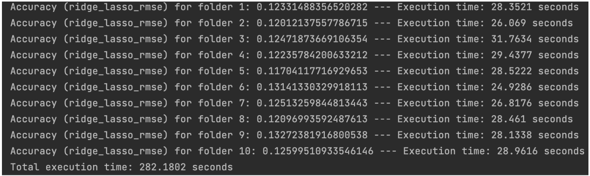
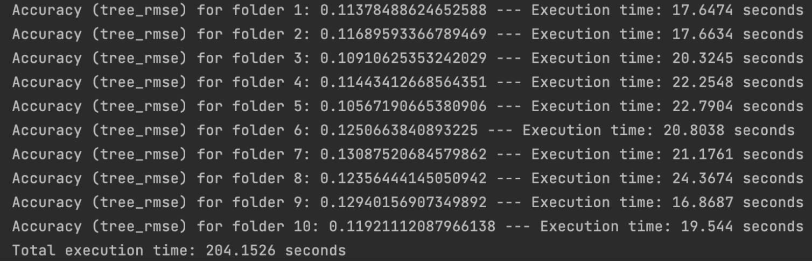

# Overview
In this project, we developed two prediction models for home prices using Ames Housing Data: a linear model using Ridge regularization and a tree model with Gradient Boosting.
# Authors:
Qi Zhou,
Yogananth Mahalingam,
Derek Zhang
# Data Pre-Processing
We conducted separate preprocessing steps for the training and test datasets, as well as for both linear and tree models because certain steps required for linear models are not necessary for tree models.
* Handling missing values for both linear and tree models:
  * With the training dataset, we identified that the "Garage_Yr_Blt" variable is the only one with missing values and replaced with zeros as garages were not present for these houses.
  * We then computed the medians for each numerical variable in the training set and utilized these medians to fill missing values in corresponding variables in the test set.
* Excluding variables due to data imbalance issue for linear model only:
  * For the training set, we examined variables where there is a dominant value (threshold set at 98%), and consequently the following categorical variables were excluded: 'Street', 'Utilities', 'Condition_2', 'Roof_Matl', 'Heating', 'Pool_QC', and 'Misc_Feature', as well as numerical variables including 'Pool_Area', 'Low_Qual_Fin_SF', and 'Three_season_porch'. Additionally, we excluded variables 'Longitude' and 'Latitude'.
  * For the test set, we excluded the same variables as excluded from the training set.
* Handling outliers for linear model only:
  * For the training set, we employed winsorization to cap values at the 95th percentile within numerical variables.
  * We then stored the maximum values for winsorized variables in the training set and used them to clip corresponding variables in the test set.
* Encoding Categorical Variables, applied for both linear and tree models:
  * We utilized OneHotEncoder from sklearn to create binary categorical variables, which
dropped new levels in the test set and added columns with zero values for categories
existing in the training set but not in the test set.
  * For the training set, we fitted the encoder and transformed the data in categorical variables.
  * We then used the fitted encoder to transform the data in the same categorical variables
within the test set.
* Normalizing data for linear model only:
  * For the training set, we utilized StandardScaler from sklearn to fit the scaler with training
data for all the variables and transform all the training data.
  * We then used the fitted scaler to transform the test data.
 
# Model:

* Linear regression model with Ridge using variables selected by Lasso
We employed a linear model with Ridge. Specifically, we first utilized LassoCV to generate the Lasso alpha (based on lambda.min) and fit the Lasso model to select variables, then we fitted a Ridge model with the alpha selected from RidgeCV on the variables selected by Lasso. We trained the Ridge model with the training data preprocessed for the linear model.

* Tree model with GradientBoostingRegressor
We utilized GradientBoostingRegressor as our tree model, with the parameters set as follows: learning_rate: 0.02, n_estimators: 1000, subsample: 0.5,max_depth: 6. We trained the Gradient Boosting model with the training data preprocessed for the tree model.

# Performance Metrics:
* Accuracy: We evaluated our models' performance based on the RMSE using separately preprocessed test data. Our results below show that both our linear model with Ridge and the tree model with Gradient Boosting successfully outperformed baselines for all 10 splits.
* Execution time: The time taken for each training/test split for both the Ridge model and Tree model is displayed below. Additionally, the total execution time for each model is provided.
* Computer system: The following outcome is derived from a computer system with the specifications: Macbook Air, 1.6 GHz, 8GB memory.

* 
  
* 

